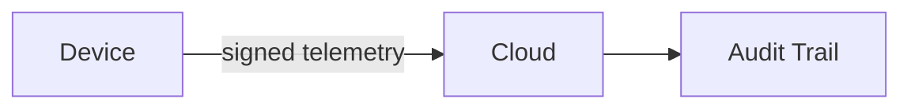

# Sentinels Branding Guide

## Design Philosophy

Sentinels follows a dark engineering aesthetic inspired by the Rust Foundation, Solana Labs, Cloudflare, and Tailscale. The design language prioritizes clarity, professionalism, and technical credibility over hype or trend-driven styling.

- No gradients (except subtle dark-on-dark)
- No emojis in official communications
- No Web3 / NFT visual language
- No AI-generated or "slop" language
- No buzzwords ("revolutionary", "game-changing", "next-gen")

## Logo

### Primary Logo

The Sentinels logo is a geometric shield containing a stylized "S" mark. The shield represents security and trust. The "S" is angular and precise, suggesting engineering rigor.

- Minimum clear space: 1x logo height on all sides
- Minimum size: 24px (digital), 0.5in (print)

### Lockup

The primary lockup places the shield mark to the left of the wordmark "Sentinels" in a monospace or geometric sans-serif typeface.

- Horizontal lockup (preferred)
- Vertical lockup (for square formats)
- Mark only (for favicon, avatar)

### Color Palette

```
Primary Background: #0a0a0b    (near-black)
Secondary Background: #121214  (dark gray)
Card Background: #18181b       (slightly lighter)
Border: #27272a                (subtle border)

Primary Text: #fafafa          (white)
Secondary Text: #a1a1aa        (zinc-400)
Muted Text: #71717a            (zinc-500)

Accent: #22c55e                (green-500 -- trust, verified)
Warning: #eab308               (yellow-500 -- anomaly)
Error: #ef4444                 (red-500 -- critical, compromised)
Info: #3b82f6                  (blue-500 -- information)
```

### Typography

```
Headings: JetBrains Mono (or any monospace)
Body: Inter (or system-ui sans-serif)
Code: JetBrains Mono (or Fira Code)
```

### Usage Rules

- Do not add effects (shadows, glows, gradients) to the logo.
- Do not change the logo colors.
- Do not place the logo on busy backgrounds.
- Do not use the logo in a way that suggests endorsement of third-party products.
- Do not animate the logo except as part of a loading state.

## Voice and Tone

### Principles

- **Precise**: Use exact language. Avoid vague qualifiers.
- **Technical**: Write for engineers. Assume competence.
- **Honest**: State limitations clearly. Do not oversell.
- **Concise**: Shorter is better. Remove unnecessary words.
- **Professional**: Formal but not stiff. No casual slang.

### Word Choice

| Use | Avoid |
|---|---|
| trust infrastructure | trust platform |
| attestation | verification (in most cases) |
| fleet operations | robot management |
| device identity | digital identity |
| tamper-evident | immutable |
| trust score | reputation score |
| anomaly detection | AI-powered insights |
| cryptographic attestation | blockchain authentication |
| on-chain anchoring | minting / NFTs |

### Writing Guidelines

- Use active voice: "The agent signs the telemetry" not "The telemetry is signed by the agent."
- Use second person: "You can deploy the agent using..."
- Use present tense: "The CLI supports..." not "The CLI will support..."
- Avoid marketing language: no "unleash," "supercharge," "turbocharge," "empower," "leverage."
- Avoid superlatives: no "best," "fastest," "most advanced."

## Documentation Style

### Code Blocks

Always specify the language:

```rust
fn attest(public_key: &[u8]) -> AttestationResult {
```

```typescript
const client = new SentinelClient({ apiKey: "..." });
```

### Diagrams

Use Mermaid for architecture and flow diagrams:



### Headings

Use sentence case for headings:

- Correct: "Device registration flow"
- Incorrect: "Device Registration Flow"

### Links

Use descriptive link text. Do not use "click here" or "read more."

---

These guidelines apply to all Sentinels repositories, documentation, websites, and communications.
